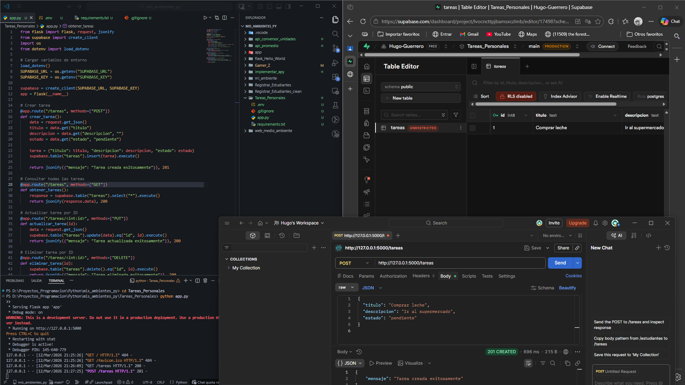
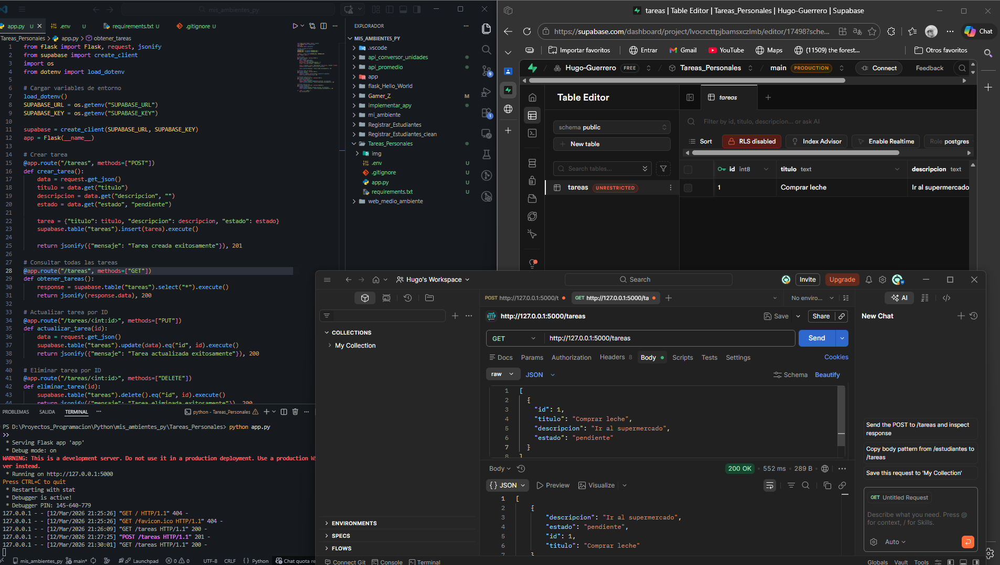
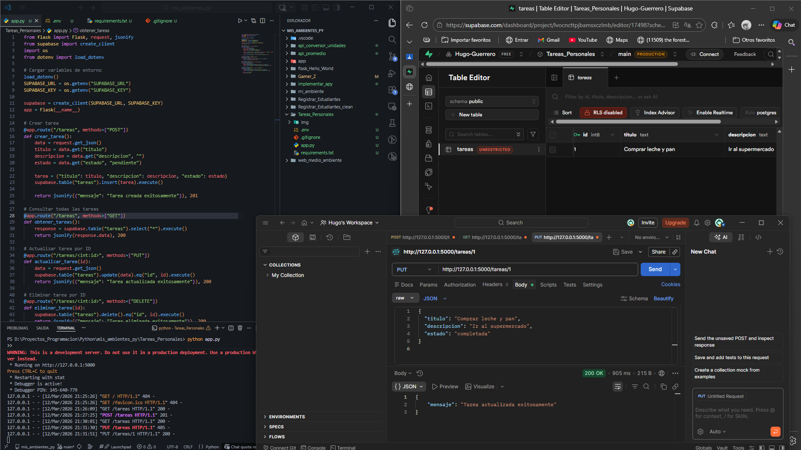
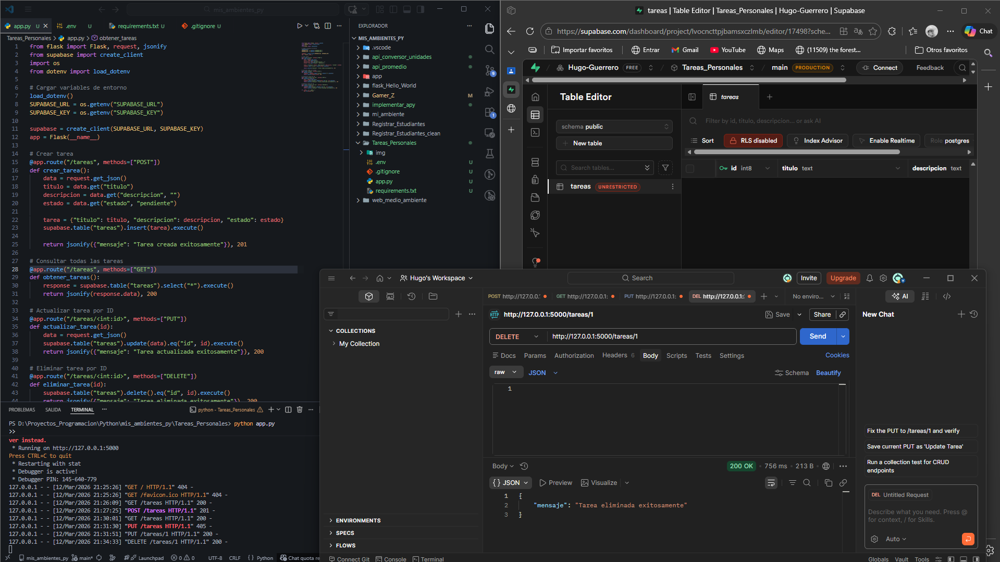

# 📌 API de Tareas Personales con Flask y Supabase

Este proyecto implementa una **API REST** para administrar tareas personales utilizando **Flask** y **Supabase**.  
Permite realizar operaciones CRUD completas: crear, consultar, actualizar y eliminar tareas.  
La API fue probada con **Postman** y documentada con capturas de cada método.

---

# 🚀 Instalación

1. Clona el repositorio:

```bash
git clone https://github.com/Hugo-Guerrero/Tareas_Personales.git
cd Tareas_Personales
```

2. Crea y activa un entorno virtual:

```bash
python -m venv mi_ambiente
mi_ambiente\Scripts\activate
```

3. Instala dependencias:

```bash
pip install -r requirements.txt
```

---

# ⚙️ Configuración del entorno

El archivo `.env` **no se incluye en el repositorio** por seguridad.  
Debes crearlo en la raíz del proyecto a partir de `example.env`.

Ejemplo:

```env
SUPABASE_URL=https://TU_PROYECTO.supabase.co
SUPABASE_KEY=sb_secret_xxxxxxxxxxxxxxxxxxxxx
```

⚠️ Usa tu **secret key de Supabase**.  
El archivo `.env` está en `.gitignore` para proteger tus credenciales.

---

# ▶️ Uso

Ejecuta la API con:

```bash
python app.py
```

La API estará disponible en:

```
http://127.0.0.1:5000
```

---

# 📌 Endpoints

## POST /tareas
Agrega una nueva tarea.

### Ejemplo JSON

```json
{
  "titulo": "Comprar leche",
  "descripcion": "Ir al supermercado",
  "estado": "pendiente"
}
```

### 📷 Prueba del método POST en Postman



---

## GET /tareas
Obtiene todas las tareas registradas.

### 📷 Prueba del método GET en Postman



---

## PUT /tareas/<id>
Actualiza una tarea existente por su ID.

### Ejemplo JSON

```json
{
  "titulo": "Comprar leche y pan",
  "descripcion": "Ir al supermercado",
  "estado": "completada"
}
```

### 📷 Prueba del método PUT en Postman



---

## DELETE /tareas/<id>
Elimina una tarea por su ID.

### 📷 Prueba del método DELETE en Postman



---

# 🧪 Pruebas rápidas con Postman

1. **POST** → `http://127.0.0.1:5000/tareas`  
   Body → JSON con título, descripción y estado.

2. **GET** → `http://127.0.0.1:5000/tareas`  
   Devuelve todas las tareas.

3. **PUT** → `http://127.0.0.1:5000/tareas/1`  
   Actualiza la tarea con ID 1.

4. **DELETE** → `http://127.0.0.1:5000/tareas/1`  
   Elimina la tarea con ID 1.

---

# 📂 Estructura del proyecto

```
Tareas_Personales/
│
├── app.py
├── requirements.txt
├── .gitignore
├── README.md
├── example.env
│
└── img/
    ├── metodo_post.png
    ├── metodo_get.png
    ├── metodo_put.png
    └── metodo_delete.png
```

---

# 📌 Comandos utilizados en Git

```bash
# Inicializar repositorio
git init

# Agregar archivos
git add .

# Primer commit
git commit -m "API de tareas personales con Flask y Supabase"

# Cambiar rama principal
git branch -M main

# Agregar remoto
git remote add origin https://github.com/Hugo-Guerrero/Tareas_Personales.git

# Subir al repositorio remoto
git push -u origin main
```

---

# ✨ Notas finales

- Este proyecto es académico y no debe usarse en producción sin ajustes de seguridad.
- Mantén tus claves fuera del repositorio.
- Puedes extender la API agregando más funcionalidades como:
  - filtrar tareas
  - marcar tareas como completadas
  - buscar tareas por estado

---

# 👨‍💻 Autor

Proyecto desarrollado por **Hugo Guerrero** como práctica de desarrollo de **APIs con Flask y Supabase**.
